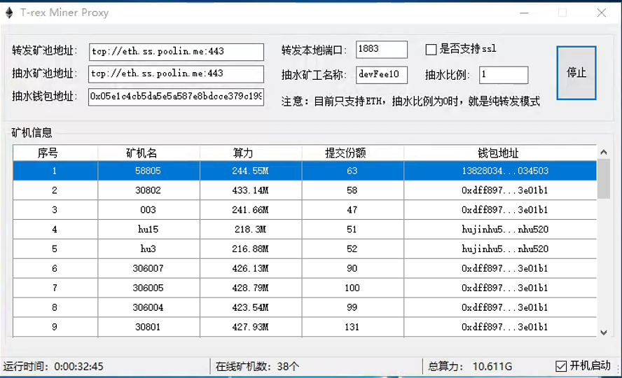

## 重要说明
```bigquery
自带tls证书
可以自定义证书,在同级目录下放入cert.pem和key.pem文件即可
软件支持多开端口，双击桌面图标配置即可，开关机自启动无需再次配置。
开发者抽水0.3%,纯转发不抽水，目前运行最稳定的软件之一
```
交流电报群https://t.me/trexminerproxy
每次改完内容就需要关闭程序再打开才能生效！

# windows版本下载:
[点击下载 ](https://github.com/ethminerpro/MinerProxyvip/raw/main/MinerProxy%20Win.exe) 。



国外香港云服务器推荐，小厂商服务器不稳定谨慎使用

阿里云:
https://cn.aliyun.com
阿里云国际：
https://au.alibabacloud.com
loc vps：
https://www.locvps.com/

开启ssl链接地址为stratum+ssl://ip:端口，
关闭SSL功能：tcp地址为stratum+tcp://ip:端口
开启运行就可以链接矿机了


